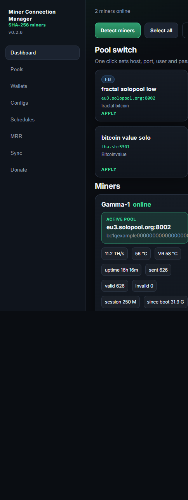
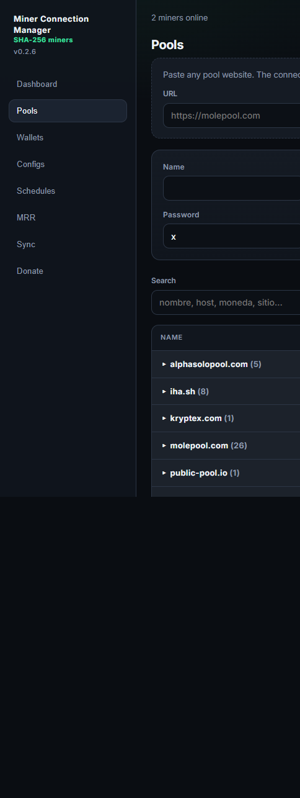
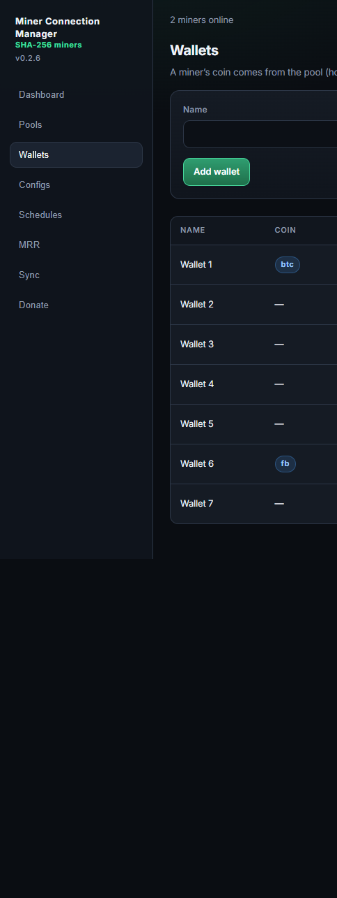
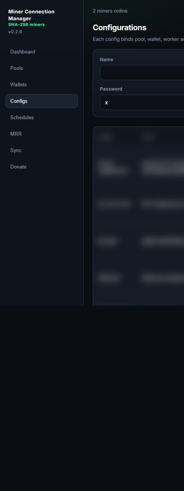
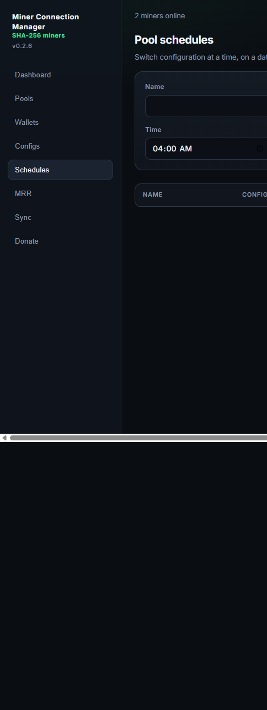
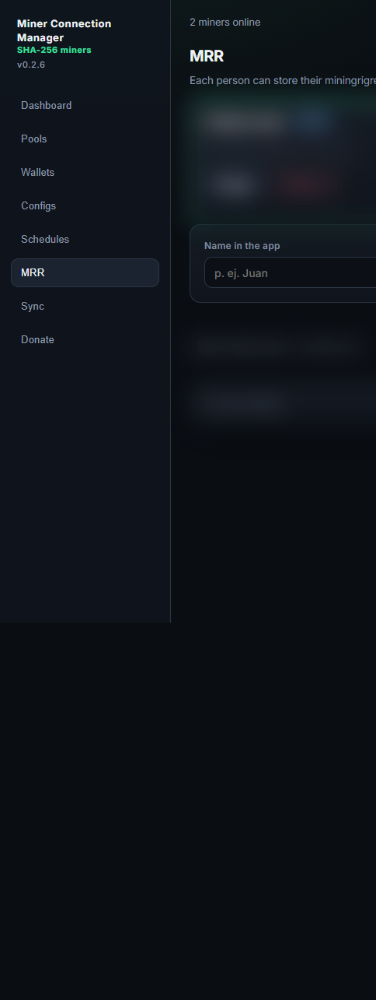
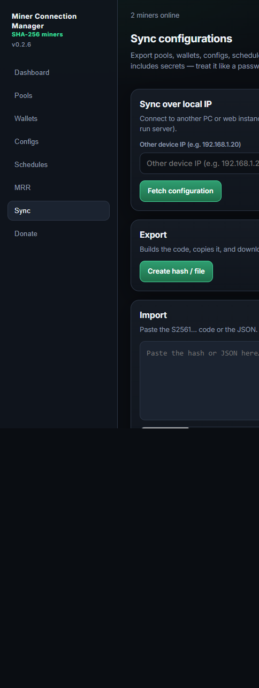
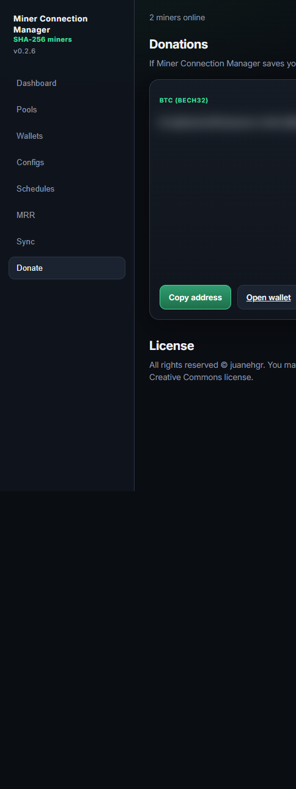

# Miner Connection Manager

Local manager for **SHA-256 ASICs**. Discover miners on your LAN, store pools and wallets, and switch stratum with one click. The same config can be applied to [Mining Rig Rentals](https://www.miningrigrentals.com/) rentals.

**v0.2.6** · Electron / web at `http://127.0.0.1:3847` · Android APK · SQLite on the device (no cloud, no accounts).

[Español](README.es.md)



---

## What it does

On a small fleet (NerdQAxe, Open ASIC, Antminer, Whatsminer and other SHA-256 boxes), changing pool usually means opening each miner’s web UI. This app:

1. Finds devices on the `/24` (HTTP JSON and cgminer/Whatsminer API on port **4028**).
2. Stores **pools**, **wallets** and **configs** (pool + wallet + worker + password).
3. Applies host, port, user and password to selected miners — or to every online miner.
4. Shows hashrate, board/VR temps, shares, uptime, active pool, network stats and MRR rentals on one dashboard.

Everything runs on your PC or phone. MRR API keys live in the local database, not in system env vars.

---

## Requirements

- Node.js **22+** (`node:sqlite`).
- LAN with the miners (same subnet or routed).
- Optional: MRR account with API key + secret.

```bash
git clone https://github.com/juanehgr/sha256-manager.git
cd sha256-manager
npm install
npm run build
npm run server
```

Open **http://127.0.0.1:3847**. Desktop (dev):

```bash
npm start
```

### Windows executable

```bash
npm install
npm run dist
```

In `release/`:

- **`SHA-256-Manager-0.2.6-portable.exe`** — no install; double-click.
- **NSIS installer** — desktop and Start Menu shortcuts (**Miner Connection Manager**).

Packaged data: `%APPDATA%\sha256-manager\data\`.

### Android (APK)

The APK is **standalone**: it scans the phone’s Wi‑Fi, stores pools/wallets on the device, and talks to miners directly. No PC required.

```bash
npm install
npm run android:apk
```

Output: `release/SHA-256-Manager-0.2.6.apk` (signed).

Google will not “trust” a sideload. On the phone:

1. Uninstall any previous build.
2. Settings → Apps → Special access → **Install unknown apps** → Files / Chrome / Drive → allow.
3. Open the APK. If **Play Protect** appears: More details → **Install anyway**.

---

## Features

### Dashboard


- **Detect miners:** mDNS + HTTP JSON + TCP 4028 on the `/24`.
- Detected miners are **saved**. Closing the app does not require a full scan next time; known IPs are refreshed.
- Cards: active pool, hashrate, board temp, **VR temp**, **uptime**, **shares sent / valid / invalid**, diffs, firmware, chart.
- Coin/network stats from the **pool** (host, port, name) — not from a `bc1` address (BTC and Fractal Bitcoin share that format).
- Miner counts are an **estimate** (~200 TH/s equivalents).
- Config cards: one click applies stratum to LAN (and MRR rentals if an account is active). **Restart after apply** sits next to the title.
- On a **narrow screen**, miners come first; pool configs are a **horizontal slider**.
- The update banner only appears when a **newer GitHub release** exists (or while a desktop download is in progress).
- Language **ES / EN** in the top bar.

### Pools



- Manual add: name, host, port, coin, password (default `x`).
- **Import from a pool website:** paste a URL (molepool, solopool, public-pool, …). The server walks docs, APIs and scripts for `host:port`.
- Group by site, search, edit. Re-import recreates deleted rows; it does not duplicate the same `host:port`.

### Wallets



- Name, address, optional coin and notes.
- Mining coin is defined by the pool, not assumed from `bc1`.

### Configs



Each row is a one-click recipe:

| Field | Use |
| --- | --- |
| Pool | Stratum host and port |
| Wallet | Payout address |
| Worker | Optional suffix |
| Password | Stratum, default `x` |
| Fallback | Backup pool (firmware that supports it) |

Stratum user is `address` or `address.worker`.

### Schedules



Switch config at a time of day, on weekdays, or at a one-off datetime (PC clock). All online miners or one MAC. Optional restart.

### Mining Rig Rentals (MRR)



- Several users, each with **API key + secret** in SQLite.
- Activate one account, list rentals (current pool, hashrate, end time).
- Apply the same pool config as local ASICs (`PUT /rental/{id}/pool`).
- Rentals also show on the dashboard.

### Sync configurations



Move pools, wallets, configs, schedules and MRR keys between devices:

- Hash / JSON file (treat it like a password).
- **Pull over local IP** from another PC/web instance listening on port **3847**, then merge or replace.
- Previous snapshot can be restored after a replace.

The Android app can pull from a PC. Two phones cannot pull from each other (the APK does not serve HTTP).

### Donate



On-chain BTC address and QR. Optional; no extra rights.

---

## Updates

The UI checks [GitHub Releases](https://github.com/juanehgr/sha256-manager/releases) on open and every 10 minutes. If latest **>** installed, **Update now** appears.

- **NSIS** can download and install (`electron-updater`).
- **Portable** `.exe` does not replace itself cleanly — download the new file.
- **Web** (`npm run server` from a git clone) can `git pull` + `npm install` + build.
- **APK** opens the GitHub `.apk` asset when a newer tag exists.

Publish (bump `package.json` first):

```bash
npm run release
```

Needs `gh` / `GH_TOKEN` with `repo`. Uploads the Windows build, `latest.yml`, and the APK.

Dev data: `data/data.sqlite` next to the project (`data/` is gitignored).

---

## How miners are talked to

| Kind | Discovery | Pool change |
| --- | --- | --- |
| HTTP JSON firmware (e.g. AxeOS) | `GET /api/system/info` | `PATCH /api/system` |
| cgminer / Antminer | TCP **4028** `summary` / `pools` | `addpool` + `switchpool` |
| Whatsminer | TCP **4028** (`cmd` / `command`) | Same cgminer API when firmware allows |

Identity is MAC when the device exposes it; otherwise an id derived from the IP.

---

## Privacy

- Binds **0.0.0.0:3847** so a phone on the same Wi‑Fi can reach a PC instance. The desktop still opens `http://127.0.0.1:3847`.
- No remote accounts, no telemetry from this app.
- MRR keys: `mrr_users` in SQLite. Do not commit `data/`.
- Applying a pool **writes to the miner**. Check the config first.

---

## Stack

React + Vite · Express (`server/`) · SQLite (`node:sqlite`) · Electron · Capacitor (Android) · HMAC-SHA1 for MRR API v2.

---

## License

**v0.2.6**. See [LICENSE](LICENSE).

Not Creative Commons. Personal use on your own machines is allowed. Redistribution, modification, and commercial use need written permission from **juanehgr**.
